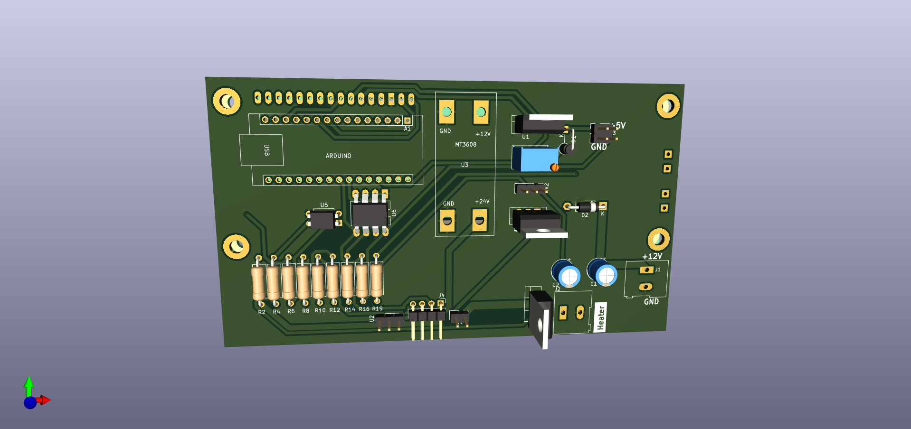

# Incubator Using PID controller - Arduino Nano.

 

The incubator system is built using an Arduino Nano and a PID controller. The key components include:

- Incubator enclosure
- PID controller for temperature regulation
- Arduino Nano as the main microcontroller
- Egg turner mechanism for gently rotating the eggs during incubation

The egg turner is an essential part of the incubator system, as it helps ensure the eggs develop properly by exposing different areas to the heat and humidity within the incubator. 

Note that the specific 3D printed holder or design for the egg turner is not included, as there are many different options and choices available for this component.

An additional Arduino board is used to control the egg turner mechanism separately from the main incubator controller.

Feel free to modify, improve, and submit pull requests to the GitHub repository for this project.

Additional Notes:

- This incubator project was originally developed in 2020.

- The photos included show an earlier, faulty version of the incubator. These were added to demonstrate the issues that were targeted and fixed in the updated design.

- The design has been further updated to fix other issues and add more footprints, using KICAD 7.0.

Mariwan Jalal 2023-05-13
